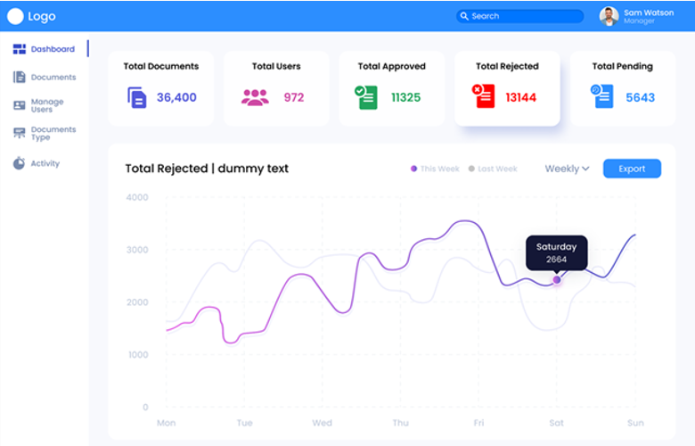

# AccelDocs

### Project description :

AccelDocs is a web development project that aims to provide a comprehensive document and compliance management system for pharmaceutical and path lab-related companies. This project is designed to help companies manage their documents and comply with the 21 CFR Part 11 regulations set by the FDA.

The system utilizes the Life Sciences module of DocuSign, a trusted eSignature and document management platform that provides a secure and reliable way to sign and store audit logs of the document. With this platform, AccelDocs provides an easy-to-use system for companies to manage their documents and comply with regulatory requirements.

The AccelDocs system is built as a multi-tenant cloud-based platform, providing the ability to manage multiple tenants with a single application instance. This ensures that each company has their own secure environment, with their own data and documents kept separate from others.

The system provides a range of features, including document management, version control, and secure electronic signatures. It also provides features for compliance management, including audit trails and reporting, ensuring that companies can easily demonstrate compliance with regulatory requirements.

AccelDocs is designed to be user-friendly, with a clean and intuitive interface that makes it easy for users to navigate and find the information they need. It is also customizable, allowing companies to configure the system to meet their specific needs and workflows.

In summary, AccelDocs is a powerful document and compliance management system designed specifically for pharmaceutical and path lab-related companies. It provides a secure, easy-to-use, and customizable platform that helps companies manage their documents and comply with regulatory requirements. 

## Screenshots

### [Checkout All Screenshots](screenshots)

#
`#Reactjs` `#Redux` `#Material UI` `#API Integration` `#axios` `SignUp` `SignIn` `#Reset Password` `#Forgot Password` `#Admin Panels` `#DocuSign`
